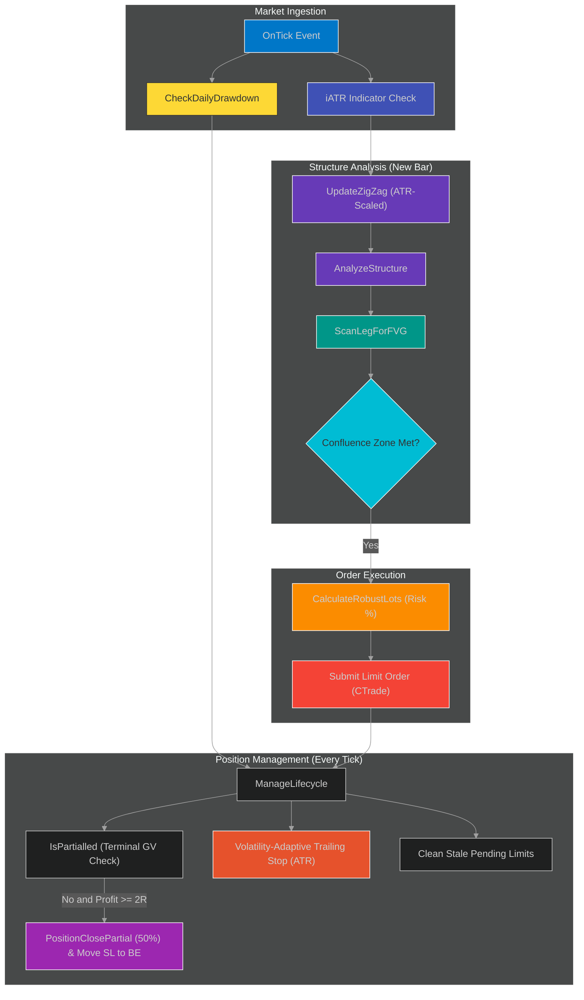
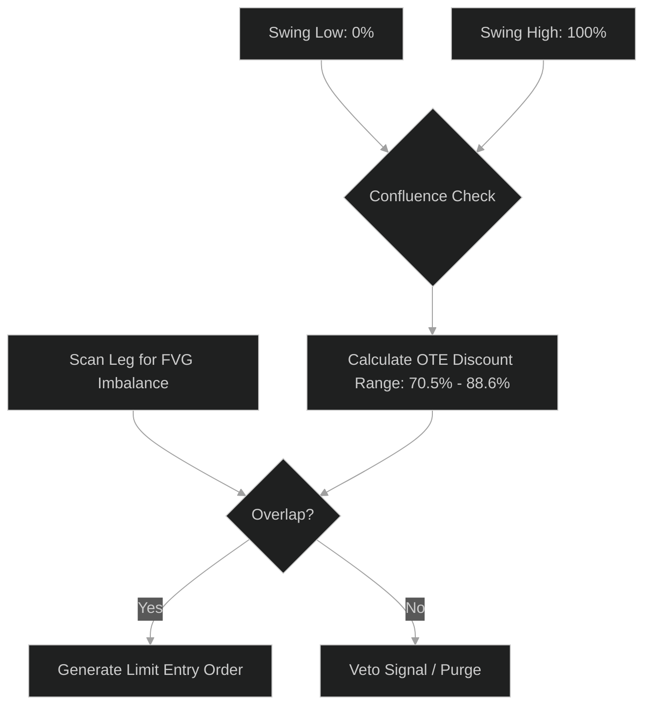
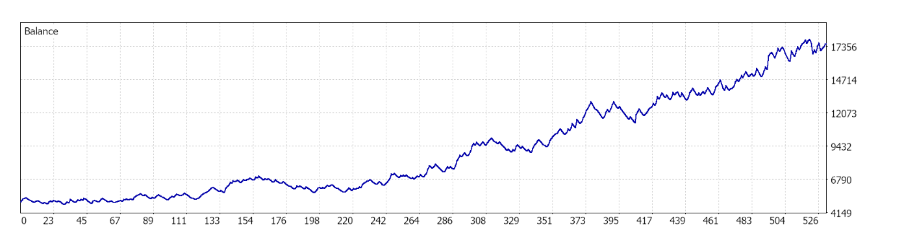
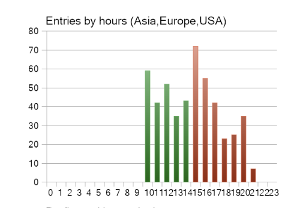
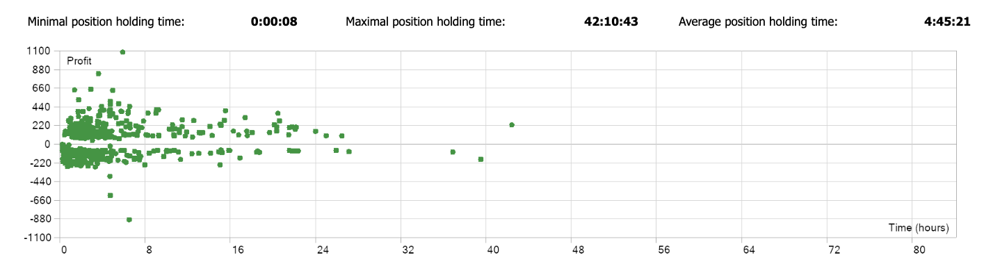

<div align="center">

# 🔱 HydraPrime


</div>

---

> **HydraPrime** is an **autonomous, object-oriented, systematic trading Expert Advisor (EA)** designed for the highly liquid Gold (XAUUSD) spot market on MetaTrader 5.
> Built entirely in MQL5, it integrates **volatility-adaptive swing structures**, **Optimal Trade Entry (OTE)** math, and **Fair Value Gap (FVG) snipers** to execute precise systematic retest setups.
>
> HydraPrime complements [SentinelPrime](https://github.com/sriramvarun0636/SentinelPrime), a Python-based event-driven trading engine focused on execution infrastructure. While SentinelPrime emphasizes distributed market data processing, HydraPrime focuses on systematic strategy execution within the MetaTrader 5 ecosystem.

---

## 📌 Project Overview

HydraPrime is a systematic, object-oriented algorithmic trading system built for the Gold (XAUUSD) spot market on MetaTrader 5.

The strategy is built around a **50% win-rate baseline with an asymmetric risk-reward profile**. The system's edge does not rely on predicting future direction; instead, it exploits intraday momentum expansions during high-liquidity sessions while maintaining rigorous drawdown controls.

### Key Metrics Summary

| Metric | Value |
| :--- | :--- |
| **Profit Factor** | 1.37 |
| **Max DD** | 13.8% |
| **Trades** | 530 |
| **Win Rate** | 50% |
| **Avg Holding** | 4.5h |

---

### Repository Structure

```text
HydraPrime/
├── HydraPrime_Gold_v1.mq5
├── docs/
│   ├── architecture.png
│   ├── equity_curve.png
│   ├── holding_time.png
│   └── session_distribution.png
├── LICENSE
└── README.md
```

---

## ⚡ Engineering Challenges Solved

Many retail EAs rely on procedural state management, making recovery from terminal restarts and execution edge cases difficult. HydraPrime is designed for robust execution reliability:

- **Persistent Trade State Recovery:** Implemented a hybrid persistence model using both in-memory arrays and MetaTrader's Terminal Global Variables (`GlobalVariableSet`). This ensures that if the VPS restarts or the terminal reboots during active positions, the EA's partial-closing and trade-tracking states survive and remain completely synchronized.

- **Execution Cost Optimization:** Configured a strict Average Position Holding Time of ~4.5 hours. By intentionally designing a medium-frequency intraday/swing strategy, the system completely bypasses the latency-dependency of HFT systems, ensuring that spread and broker commission do not erode trading edge.

- **Race-Safe Position Tracking:** Replaced raw, procedural index polling with MetaTrader 5's object-oriented standard library wrappers (`COrderInfo` and `CPositionInfo`). This isolates order-state queries and prevents race conditions during rapid multi-order execution or partial closures.

- **Adaptive Filling-Mode Negotiation:** Dynamically queries the broker's specific execution rules at initialization (`SYMBOL_FILLING_MODE`) to negotiate whether orders must be executed via Fill-Or-Kill (FOK), Immediate-Or-Cancel (IOC), or Return, preventing execution rejections.

---

## 🏗️ Architecture & Execution Flow

HydraPrime is organized as a decoupled, state-aware execution engine. State tracking is separated from execution to prevent race conditions during rapid price shifts.



### Core Components

| Component | Type | Role |
| :--- | :--- | :--- |
| `CTrade trade` | Broker Client | Central execution client; manages limit placements |
| `CPositionInfo posInfo` | State Auditor | Audits state-tracking for open orders and active lots |
| `COrderInfo orderInfo` | Order Manager | Manages pending, un-filled, or expiring execution limits |
| `CSwingNode` | State Object | Tracks historical swing leg data for structure scanning |

---

## 🧠 Trading Logic

HydraPrime converts market structure into high-probability execution opportunities through a three-stage decision pipeline.

### 1. Volatility-Adaptive Swing Engine

The core swing engine analyzes price action on the M5 timeframe. Instead of using static point-steps, the swing high/low threshold is dynamically calculated using a multiplier of the live Average True Range (ATR):

```
Deviation Threshold = InpBaseSwing_Dev × ATR(14)
```

This filters out daily price noise while scaling swing legs to adapt to volatile expansions.

### 2. OTE & FVG Confluence

Rather than chasing momentum, HydraPrime waits for price to retrace into statistically favorable discount or premium zones before entering. This reduces average entry price while maintaining predefined risk.

Once a valid swing leg is formed, the engine calculates the **Optimal Trade Entry (OTE)** range between **70.5% and 88.6%** of the leg's retracement. Simultaneously, `ScanLegForFVG` scans the leg for a structural Fair Value Gap (FVG) imbalance.



### 3. Session-Aware Liquidity Filtering

Gold is highly dependent on global session liquidity. HydraPrime restricts execution to the high-volume hours of the global day — specifically the **London Open**, the **London/New York overlap**, and the **US session** (08:00 to 18:00 GMT). By systematically avoiding low-volume Asian range-bound sessions, the system minimizes transaction friction and spread tax.

---

## 🛡️ Risk Engine

The system's Risk Engine enforces capital preservation at the portfolio, account, and trade levels.

### 1. Dynamic Position Sizing

Position size is never static. `CalculateRobustLots` uses MetaTrader's native `OrderCalcProfit` to compute the exact monetary risk of a single lot from the entry limit to the calculated stop loss:

```
Lots = Floor( (Account Equity × Risk%) / (Loss Per Lot) ÷ Step ) × Step
```

### 2. Microstructure Partialing

To secure profit and reduce exposure, the system executes a **50% partial close** once a trade reaches **+2.0R** in profit. The remaining position's stop loss is immediately moved to `entry + 50-point safety buffer`.

### 3. Multi-Layered Risk Architecture

| Level | Control | Mechanism |
| :--- | :--- | :--- |
| **Account** | Hard Daily Drawdown (5.0%) | `CheckDailyDrawdown()` evaluates equity on every tick; liquidates all active positions and deletes pending limits upon breach. |
| **Environment** | Maximum Spread Limit (400 points / $0.40) | `SpreadOk()` blocks any order placement if spreads widen during news events or market rollover. |
| **Operational** | Expiration Cleanup (12 bars) | `ManageLifecycle()` scans pending limits; if an order has sat unfilled for more than 12 bars (60 minutes on M5), it is deleted. |
| **Trailing** | Volatility Trailing Stop (3.5 × ATR) | Adjusts stop loss dynamically behind profitable trades, allowing the system to run on high-trend extensions. |

---

## 📊 Empirical Backtest Verification (XAUUSD May 2024 – May 2026)

This strategy was subjected to a rigorous backtest on MetaTrader 5 using **99% Real Tick Data (96+ Million Ticks)** over a continuous two-year period representing highly volatile macroeconomic regimes.

### Performance Summary

| Metric | Value |
| :--- | :--- |
| **Initial Deposit** | $5,000.00 |
| **Total Net Profit** | $12,596.88 (~252% Net Return) |
| **Profit Factor** | 1.37 |
| **Maximal Equity Drawdown** | 13.83% |
| **Recovery Factor** | 6.97 |
| **Expected Payoff** | $23.77 per trade |
| **Total Trades** | 530 (~5 trades/week) |
| **Win Rate** | 50.00% |
| **Avg Win / Avg Loss** | $175.97 / $128.43 (1.37 : 1) |

---

## 📈 Backtest Execution Graphics

### 1. Balance & Equity Curve
Steady, stepwise equity growth across shifting volatility regimes from 2024 to 2026.



### 2. Session/Hourly Entry Distribution
Demonstrates that the algorithm concentrates its execution during peak London and New York liquidity hours.



### 3. Position Holding Time Distribution
Shows that the average holding time of ~4.5 hours keeps the strategy safe from spread/slippage erosion.



---

## 🛠️ Technology Stack & Platform

| Component | Detail |
| :--- | :--- |
| **Language** | MQL5 (Object-Oriented C++ derivative) |
| **Platform** | MetaTrader 5 (MT5) |
| **Execution Infrastructure** | Windows VPS for low-latency broker connectivity |
| **Backtest Engine** | MT5 Strategy Tester (99% Real Tick Data) |

---

## 🚀 Getting Started

### Prerequisites

- MetaTrader 5 Client Terminal installed
- A trading account with an MT5-compatible broker (RAW/ECN spreads recommended)
- Access to real-time history or tick data subscription (99% history quality)

### Installation

1. Open MT5 and go to **File → Open Data Folder**
2. Navigate to `MQL5/Experts/` and create a folder named `HydraPrime`
3. Copy `HydraPrime_Gold_v1.mq5` into that folder
4. Restart MT5 or right-click **Experts** in the Navigator panel and select **Refresh**

### Compilation & Running

1. Double-click the file to open it in MetaEditor and press **Compile (F7)**
2. Drag the compiled EA onto the **XAUUSD M5** chart
3. Under the **"Common"** tab, check **"Allow Algo Trading"**

---

## ⚠️ Disclaimer

This software is provided **"AS IS"** for educational and research purposes **ONLY**. Algorithmic trading in financial derivative markets, particularly volatile commodities like Gold (XAUUSD), involves substantial risk of loss and is not suitable for all investors. Past performance, even on high-fidelity historical data, is not a guarantee of future live results. Always practice safe risk management and start with a demo/paper account.
